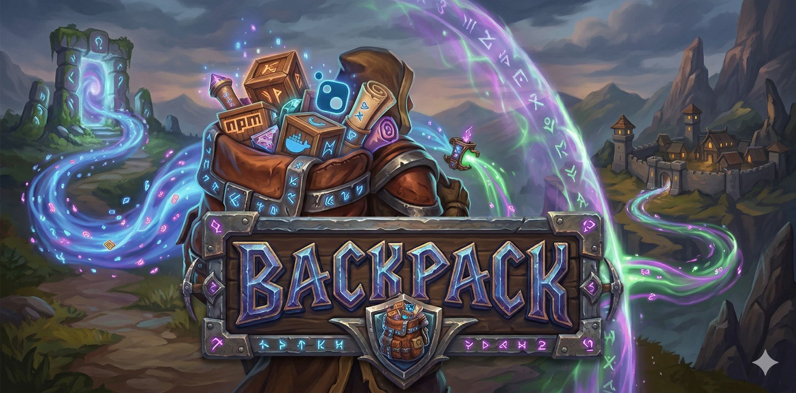

  

# Backpack: Distributed Artifact Synchronization & Mirroring Engine

Backpack is a high-performance, distributed system for people whose security teams have serious trust issues. It is engineered for those building in the quiet, isolated comfort of air-gapped bunkers who still need their 4GB of `node_modules` despite having zero bytes of external connectivity.

At its core, Backpack is a **one-way artifact collection and tracking engine**. It doesn't host repositories or serve files to your developers; instead, it acts as a tireless background harvester. It recursively resolves dependency trees for entire ecosystems (NPM, Docker, NuGet, etc.), fetches every available version, and persists them into a unified S3-compatible storage layer for later transfer to your isolated environment. 

Think of it as a professional-grade, recursively-obsessive digital hoarder: Backpack siphons every version and every dependency from the public internet and stuffs them into your private storage. It harvests all, presents nothing, and ensures that when the internet inevitably lets you down (or your firewall is just that good), your codebase is already stocked for the long-term survival of your builds.

## 📖 Documentation Index

To understand the system's design and operational details, refer to the following guides:

### Core Architecture & Strategy
- **[System Philosophy & Standards](GEMINI.md)**: Core mandates, greedy collection logic, and architectural principles.
- **[Architecture & Diagrams](docs/ArchitectureDiagrams.md)**: Visual representation of message propagation and service interaction.
- **[Service & Module Inventory](docs/ServiceInventory.md)**: Detailed inventory of all core modules, processors, and collectors.
- **[Storage Architecture](STORAGE.md)**: Detailed breakdown of the S3-hierarchical structure and `Collector.Kernel` implementation.
- **[Glossary of Terms](docs/Glossary.md)**: Standardized definitions for Backpack architecture, roles, and components.
- **[Type Reference](docs/TypeReference.md)**: Technical schemas for internal messages and metadata structures.

### Deployment & Configuration
- **[Configuration Guide](docs/Configuration.md)**: Environment variables, service endpoints, and infrastructure settings.
- **[Deployment Guide](docs/DeploymentGuide.md)**: Full solution deployment (Docker Compose and Kubernetes/Helm).
- **[Development Setup](docs/DevelopmentSetup.md)**: Detailed technical instructions for local development environments.
- **[Troubleshooting](docs/Troubleshooting.md)**: Common failure patterns and resolution steps.

### Extension & Integration
- **[Ecosystem Integration Guide](docs/EcosystemIntegration.md)**: High-level overview of implementing custom package managers.
- **[Tutorial: New Ecosystem Processor](docs/NewEcosystemTutorial.md)**: Step-by-step guide to scaffolding and implementing a new processor.
- **[Raw Integration API](docs/RawIntegration.md)**: Documentation for interacting directly with the `Integration.API`.

## Core Architectural Principles

The system follows a **microservice-oriented architecture** centered around a decoupled message-passing pattern.

*   **Distributed Orchestration:** Leveraging **MassTransit** and **RabbitMQ** for reliable message delivery and service discovery.
*   **Greedy Ingestion Logic:** By default, the system performs exhaustive dependency graph resolution. It recursively identifies and collects every version and every dependency version of a target artifact until the entire tree is mirrored locally.
*   **Storage Abstraction:** All persistence operations are handled via a unified `FileSystem` kernel, abstracting S3-compatible object storage (MinIO/AWS S3) for long-term retention.
*   **Ecosystem-Agnostic Core:** The logic for "how to find" (Processors) is separated from "how to fetch" (Collectors), allowing for rapid integration of new package managers.

## System Components

### 1. Core Services
- **`Core.Gateway`**: The central orchestrator. It manages the state machine for artifact ingestion, routing requests between Processors and Collectors, and ensuring metadata consistency in **MongoDB**.
- **`Integration.API`**: A RESTful gateway for system management and manual ingestion triggers, secured via **OIDC** (OpenID Connect).
- **`Tracker.Scheduler`**: A **Quartz.NET**-driven scheduling engine that monitors external registries for updates and triggers periodic synchronization jobs.

### 2. Artifact Processors
Processors are ecosystem-specific logic units responsible for metadata extraction and dependency resolution.
- **Ecosystems**: NPM, PyPi, NuGet, Maven, Helm, Terraform, HuggingFace, Container Images (OCI), and JetBrains IDEs.
- **Function**: They consume an `ArtifactProcessRequest`, resolve the dependency manifest, and emit `ArtifactRouteRequest` messages for individual files.

### 3. Artifact Collectors
Collectors are protocol-specific workers responsible for the physical retrieval of resources.
- **Protocols**: **HTTP/HTTPS**, **Git** (full repository synchronization), **Skopeo/OCI** (registry-to-registry copies), **Docker Archive** (.tar image files), **Rsync**, and **Wget**.
- **Efficiency**: Implements daily delta logic, utilizing `ETags` and `Last-Modified` headers to minimize egress costs and bandwidth usage.

## Technical Stack

- **Runtime**: .NET 8.0 (C#)
- **Messaging**: MassTransit with RabbitMQ transport.
- **Persistence**: S3-compatible Object Storage (Artifacts), MongoDB (Metadata), Redis (Distributed Caching).
- **Observability**: Fully instrumented with **OpenTelemetry** (Tracing, Metrics, Logs).
- **Security**: Generic OIDC provider support with RBAC (Role-Based Access Control).

## Infrastructure Requirements

To run a full production-ready suite of Backpack services, the following infrastructure sidecars are required:
- **RabbitMQ**: Message brokering.
- **MinIO/S3**: Artifact persistence.
- **MongoDB**: Metadata and tracking state.
- **Redis**: Rate limiting and caching.
- **OIDC Provider**: Authentication (e.g., Keycloak).

---
*Note: This project is optimized for horizontal scalability and high-concurrency ingestion workloads.*
