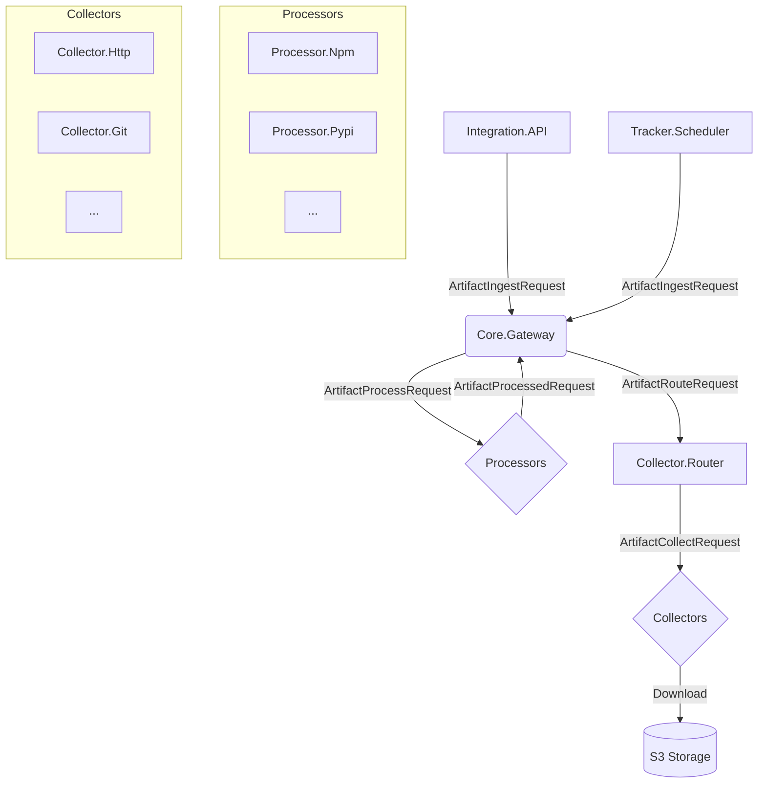

# Architecture Diagrams

## Message Propagation Diagram
The following diagram illustrates the flow of messages and artifact ingestion requests through the Backpack ecosystem.

```mermaid
graph TD
    API[Integration.API] -- ArtifactIngestRequest --> GW(Core.Gateway)
    SCHED[Tracker.Scheduler] -- ArtifactIngestRequest --> GW
    GW -- ArtifactProcessRequest --> PROC{Processors}
    PROC -- ArtifactProcessedRequest --> GW
    GW -- ArtifactRouteRequest --> ROUTER[Collector.Router]
    ROUTER -- ArtifactCollectRequest --> COLL{Collectors}
    COLL -- Download --> STORAGE[(S3 Storage)]

    subgraph Processors
        PROC_NPM[Processor.Npm]
        PROC_PYPI[Processor.Pypi]
        PROC_...[...]
    end

    subgraph Collectors
        COLL_HTTP[Collector.Http]
        COLL_GIT[Collector.Git]
        COLL_...[...]
    end
```
