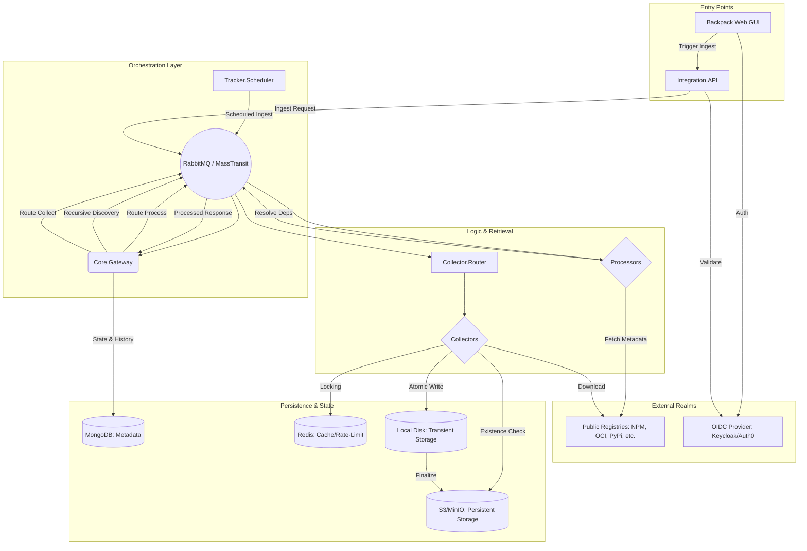
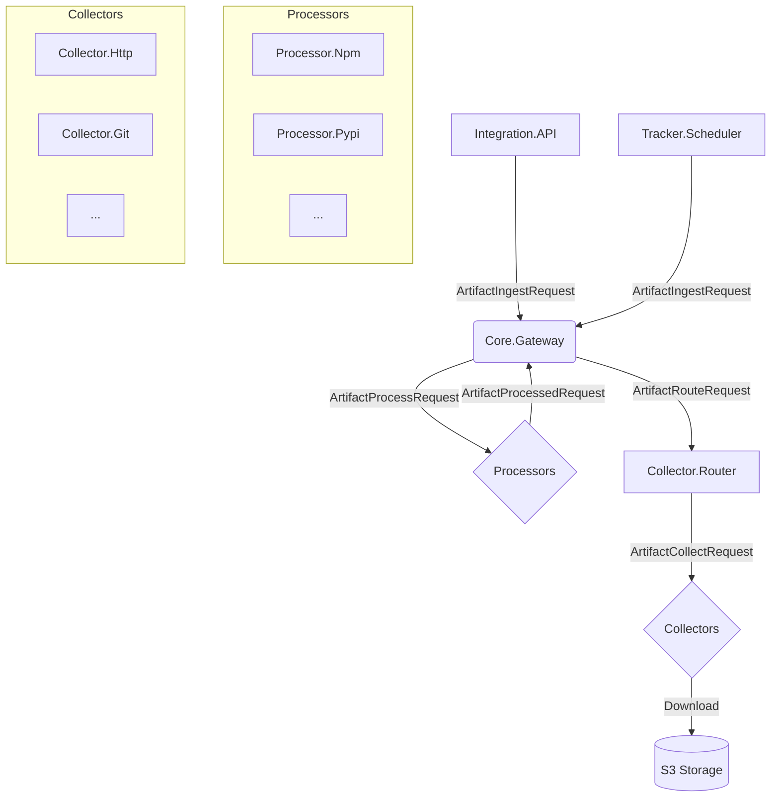

# Architecture Diagrams

## Advanced Architectural View
This diagram illustrates the high-level orchestration, state management, and storage flows within the Backpack ecosystem.

## Message Propagation Diagram
The following diagram illustrates the simplified flow of messages and artifact ingestion requests.

